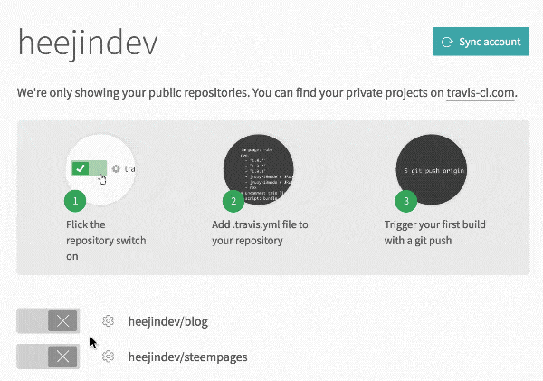
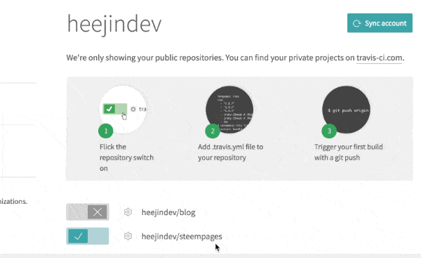
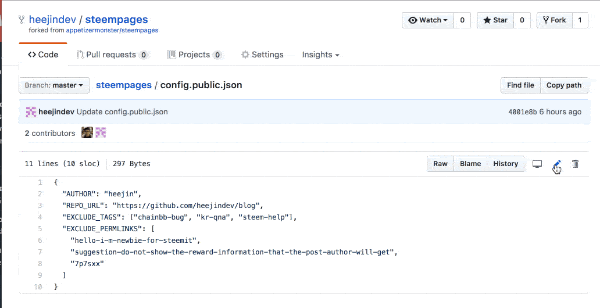

# Steempages
**Stemmpages** helps you to create your own Github Pages Blog with your Steemit posts.

Steempages has the following benefits:
- You can create your own blog site using your Steemit posts.
- You don't need any paid Server hosting services, **IT'S FREE!**
- You can use Disqus, Google Analytics, and more just like Github Pages.

Check out [DEMO blog](https://appetizermonster.github.io./blog)!

## How it works?
Steempages uses the build feature of Travis CI to synchronize your Steemit posts to Github Pages repo.

## Quick Start

### Step 1. Prepare your Github Pages repo for blog

First, you need Github Pages repo for blog.  
You can make your own Github Pages repo by following
[Jekyll Now Guide](https://github.com/barryclark/jekyll-now).

### Step 2. Fork Steempages repo

Fork this repository by clicking the `Fork` button in the top right corner.
You don't need to make any changes yet.

### Step 3. Create Github Personal Access Token

Steempages need your Personal Access Token to update your Github Pages repo.

Click [Here](https://github.com/settings/tokens) to create a Personal Access Token.  
Check the `repo` permission as shown below.  
**No other permissions are required.**

Once the token is generated, copy the token and keep it in a temporary safe place. it's required in the next step.

### Step 4. Setup Travis CI
Travis CI is required for automatic synchronization.  
You can use Travis CI with your Github account.

[Travis CI](https://travis-ci.org)

You will see `steempages` on your `Accounts` page.  
Turn on the option to use Travis CI in your `steempages` repo and open the `Settings` in the repo.

In Environment Variables, Enter Name as `API_TOKEN`, Value as Personal Access Token generated in Step 3, and press `Add` button to add environment variable.

### Final Step. Configure your Steempages repo
Open the `steempages` repository forked in Step 2.  
You have to edit `config.public.json` file.  

Open the config file as shown in the figure below.  
Put your Steemit ID for `AUTHOR`, and the URL of your Github Pages repository in `REPO_URL` (for example: https://github.com/appetizermonster/blog)  

You can customize the rest settings.
Finally, when you save and commit the file, Steemit posts will be uploaded to your Github Pages repo.  
You can check the build status in the Travis CI.  
After the build, you can see the Steemit posts on your blog!

## Known Issues
### Markdown rendering may be different from Steemit.com
Steemit and Github Pages have different ways of markdown rendering.
So there may be some rendering issuses.  
If you have issues, please report the issue.

## Contribution
Any pull requests are welcome!

## LICENSE

[MIT](LICENSE)
